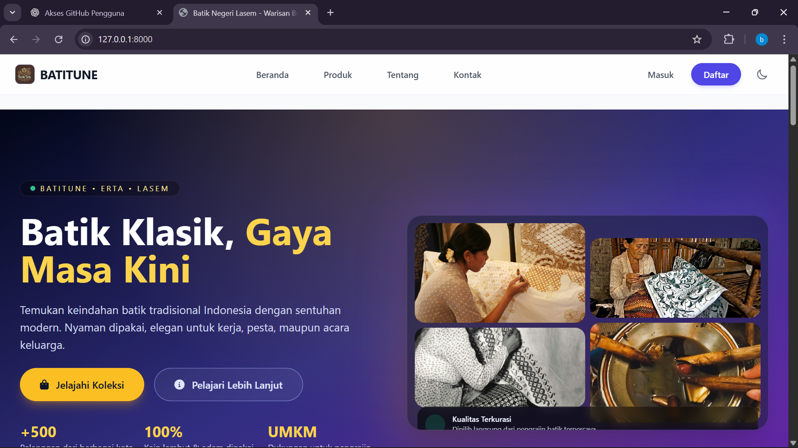
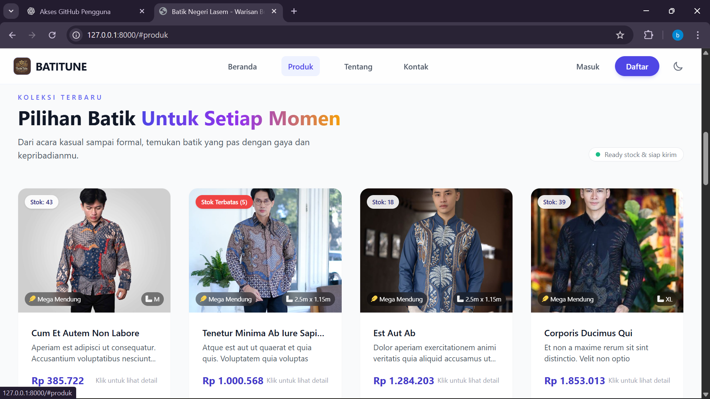
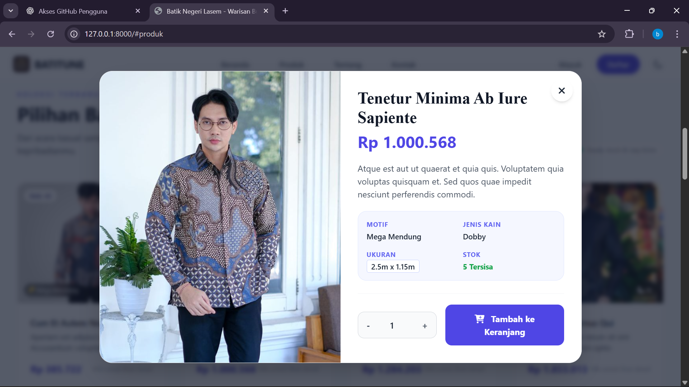
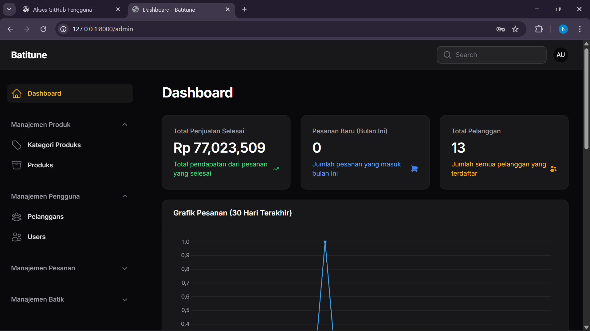

# 🛍️ BATITUNE – Batik Tulis E-Commerce Platform


**BATITUNE** adalah aplikasi e-commerce berbasis web yang dikembangkan khusus untuk mendukung digitalisasi UMKM Batik Tulis. Sistem ini mengubah proses penjualan dan manajemen produk manual menjadi platform digital yang terpusat, terstruktur, dan mudah dikelola.

Aplikasi ini mencakup etalase belanja untuk pelanggan dan dashboard admin yang kuat berbasis **Filament** untuk mengelola produk, pesanan, dan laporan keuangan.

---

## ✨ Fitur Utama

### 🛒 Sisi Pelanggan (Front-End)
- **Katalog Produk Interaktif:** Pencarian dan filter produk batik.
- **Detail Produk Lengkap:** Informasi spesifik seperti Motif, Jenis Kain, dan Ukuran.
- **Keranjang & Checkout:** Alur pembelian yang mulus.
- **Pembayaran Online:** Terintegrasi dengan **Midtrans** Payment Gateway.
- **Ulasan Produk:** Pelanggan dapat memberikan rating dan ulasan.

### ⚙️ Panel Admin (Filament V3)
- **Dashboard Analitik:** Grafik penjualan dan ringkasan performa toko.
- **Manajemen Produk Spesifik Batik:** Input detail khusus seperti *Warna Dominan*, *Motif Batik*, *Jenis Kain*, dan *Berat Gram*.
- **Manajemen Stok Otomatis:** Filter otomatis untuk stok menipis (< 10 items).
- **Manajemen Pesanan:** Update status pesanan dan verifikasi pembayaran.
- **Laporan:** Ekspor data transaksi.

---

## 🛠️ Teknologi yang Digunakan

Proyek ini dibangun menggunakan teknologi terbaru:

- **Backend Framework:** Laravel 12.x
- **Admin Panel:** FilamentPHP 3.3
- **Frontend Styling:** Tailwind CSS 4.0 (via Vite)
- **Database:** MySQL
- **Payment Gateway:** Midtrans
- **Language:** PHP 8.2+

---

## 📸 Tangkapan Layar (Screenshots)

| Halaman Utama | Daftar Produk |
|:---:|:---:|
|  |  |

| Detail Produk | Dashboard Admin |
|:---:|:---:|
|  |  |

> *Note: Pastikan gambar disimpan di folder `screenshots` di root direktori proyek.*

---

## 🚀 Instalasi & Konfigurasi

Ikuti langkah-langkah berikut untuk menjalankan proyek di komputer lokal:

### 1. Clone Repositori
```bash
git clone [https://github.com/TeguhAldianto/batitune-batik.git](https://github.com/TeguhAldianto/batitune-batik.git)
cd batitune-batik

```

### 2. Install Dependencies

Install paket PHP dan Node.js:

```bash
composer install
npm install

```

### 3. Konfigurasi Environment

Duplikat file `.env.example` menjadi `.env`:

```bash
cp .env.example .env

```

Buka file `.env` dan sesuaikan konfigurasi berikut:

**Database:**

```env
DB_CONNECTION=mysql
DB_HOST=127.0.0.1
DB_PORT=3306
DB_DATABASE=batitune_db
DB_USERNAME=root
DB_PASSWORD=

```

**Midtrans (Payment Gateway):**

```env
MIDTRANS_SERVER_KEY=your-server-key-here
MIDTRANS_CLIENT_KEY=your-client-key-here
MIDTRANS_IS_PRODUCTION=false

```

### 4. Generate Key & Storage Link

```bash
php artisan key:generate
php artisan storage:link

```

> *Penting: `storage:link` wajib dijalankan agar gambar produk bisa muncul.*

### 5. Migrasi Database & Seeder

Jalankan migrasi untuk membuat tabel dan mengisi data dummy:

```bash
php artisan migrate --seed

```

### 6. Build Assets

Compile aset Tailwind CSS:

```bash
npm run build

```

### 7. Jalankan Server

```bash
php artisan serve

```

Akses aplikasi di: `http://localhost:8000`
Akses panel admin di: `http://localhost:8000/admin`

---

## 👤 Akun Demo (Seeder)

Jika Anda menjalankan `--seed`, Anda dapat masuk ke admin panel menggunakan:

* **Email:** `admin@batitune.com`
* **Password:** `password`

---

## 📂 Struktur Proyek

* `app/Filament/` – Konfigurasi dan Resource Panel Admin (Produk, Pesanan, User).
* `app/Models/` – Model Eloquent (Produk, Pesanan, ItemKeranjang, dll).
* `resources/views/` – Tampilan Frontend (Blade Templates).
* `database/migrations/` – Struktur database.
* `public/` – Aset publik dan upload file.

---

## 👨‍💻 Kontributor

Proyek ini dikembangkan sebagai **Proyek Akhir** oleh:

**Teguh Aldianto**

* 📧 Email: [aldinamanya08@gmail.com](mailto:aldinamanya08@gmail.com)
* 💼 LinkedIn: [Teguh Aldianto](https://www.linkedin.com/in/teguh-aldianto-705653298)
* 🐙 GitHub: [TeguhAldianto](https://www.google.com/search?q=https://github.com/TeguhAldianto)

---

## 📄 Lisensi

Proyek ini bersifat open-source di bawah lisensi [MIT license](https://opensource.org/licenses/MIT).
